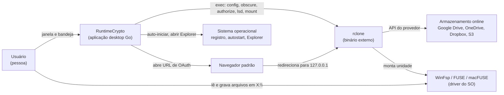
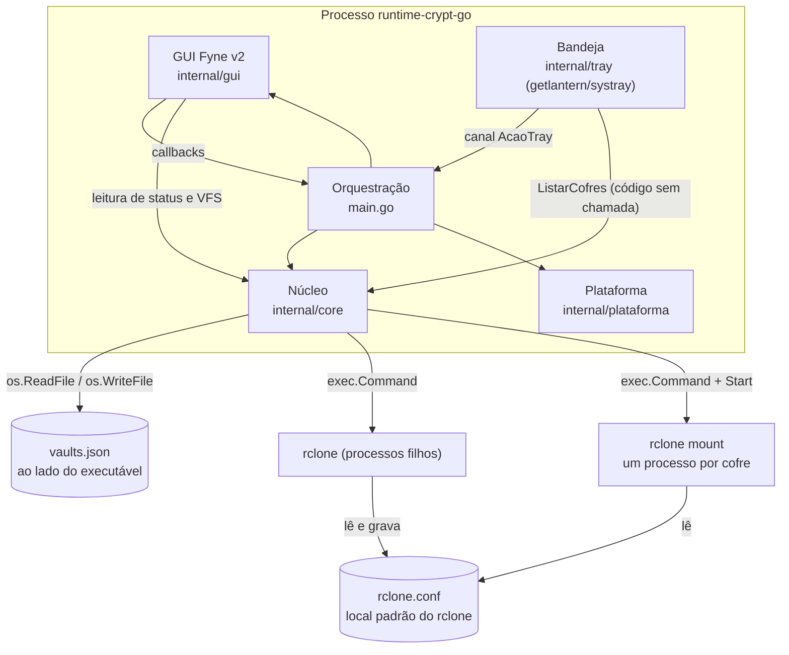
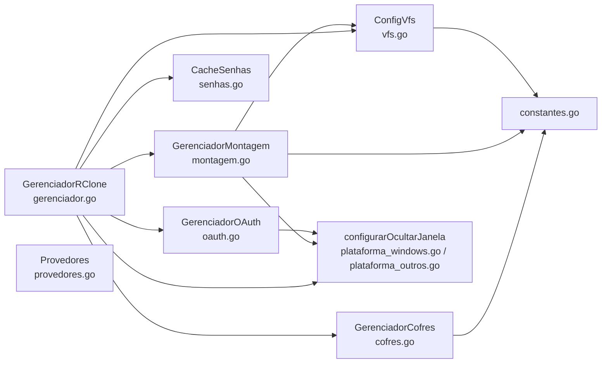

# 04 — Arquitetura

Os diagramas usam `flowchart` do mermaid no formato C4: contexto, contêineres e componentes. A sintaxe `C4Context` do mermaid ainda é experimental, por isso não foi usada.

## Nível 1 — Contexto

O programa não fala com nenhum provedor diretamente. Todo acesso à nuvem passa pelo processo `rclone`.

## Nível 2 — Contêineres

O programa não passa `--config` ao rclone. O `rclone.conf` usado é o padrão do rclone para o usuário. O caminho exato depende do SO e da versão do rclone, e o programa não o mostra.

## Nível 3 — Componentes do `internal/core`

| Componente | Responsabilidade | Estado que guarda |
|---|---|---|
| `GerenciadorRClone` | Localiza o rclone; cria, lista e remove remotos; ofusca senhas; lista pastas remotas; encerra tudo | Caminho do executável e do diretório do app |
| `GerenciadorCofres` | Lista de cofres e persistência em `vaults.json` | `[]Cofre` em memória, `sync.RWMutex` |
| `GerenciadorMontagem` | Inicia e para `rclone mount`; escolhe letra; status | `map[letra]*InfoMontagem`, `sync.Mutex` |
| `CacheSenhas` | Senhas da sessão | `map[nome]senha`, `sync.RWMutex` |
| `GerenciadorOAuth` | Roda `rclone authorize` e lê URL e token da saída | Processo atual, URL e token |
| `ConfigVfs` | Parâmetros VFS e conversão em flags | `map[chave]valor`, `sync.RWMutex` |

## Onde a lógica mora hoje

O `core` não importa Fyne. Isso já está certo. Mas a orquestração dos casos de uso está em `main.go`, e algumas regras estão em `internal/gui`:

| Lógica | Arquivo hoje | Deveria estar |
|---|---|---|
| Fluxo criar cofre (OAuth, remoto base, crypt, gravação) | `main.go:acaoNovoCofre` | `core` |
| Fluxo conectar existente | `main.go:acaoImportarCofre` | `core` |
| Destrancar e trancar, uso do cache de senha | `main.go:destravarCofre`, `travarCofre` | `core` |
| Laço de espera do token OAuth (120 s) | `main.go`, duplicado em dois lugares | `core/oauth.go` |
| Auto-montar | `main.go:autoMontarCofres` | `core` |
| Senha ≥ 8, confirmação, nome não vazio, `password2` padrão | `gui/wizards.go` | `core` |
| Montar caminho remoto (`splitCaminho`, `joinCaminho`) | `gui/seletor_pasta.go` | `core` |

Isso pesa na migração para Wails ([ADR-0007](adr/0007-interface-wails.md)). O que ficar em `main.go` ou `internal/gui` precisa ser reescrito no frontend ou perdido. A [demanda 017](demanda/017-extrair-logica-para-core.md) move essa lógica antes da migração.

## Concorrência

- Fyne roda o laço de eventos na goroutine principal (`aplicacao.Run()`). A bandeja roda `systray.Run` em outra goroutine (`main.go:main`). O `getlantern/systray` documenta que `Run` deve ficar na thread principal no macOS. O efeito em cada SO é desconhecido. Não foi testado.
- O Fyne 2.6+ exige `fyne.Do` ou `fyne.DoAndWait` para mexer em widgets fora da goroutine principal (`fyne.io/fyne/v2@v2.7.4/thread.go`). O código mexe em widgets a partir de goroutines em `janela_principal.go:agendarAtualizacao`, `seletor_pasta.go` (goroutine de carga) e em todos os `go acao...` de `main.go`, que abrem diálogos. Nenhum `fyne.Do` é usado.
- Os diálogos (`DialogoSenha`, `DialogoMensagem`, wizards) bloqueiam a goroutine chamadora em um canal até o clique. Por isso `main.go` os chama dentro de `go ...`.

## Dependências

| Dependência | Versão (`go.mod`) | Uso |
|---|---|---|
| `fyne.io/fyne/v2` | v2.7.4 | GUI |
| `github.com/getlantern/systray` | v1.2.2 | Bandeja |
| `golang.org/x/sys` | v0.45.0 | Registro do Windows |
| `rclone` | não fixada; o README pede 1.60+ | Processo externo |
| WinFsp / FUSE / macFUSE | não fixada | Driver de montagem |

O `go.mod` também traz `fyne.io/systray v1.12.1` como indireta. O Fyne tem bandeja própria (`desktop.App`), e o programa usa outra biblioteca para a mesma função.
