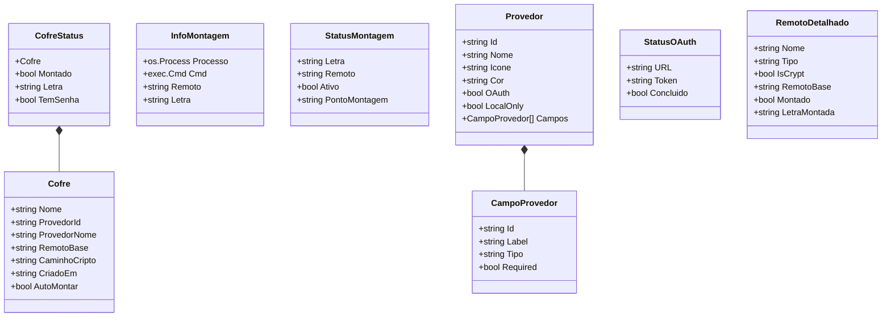

# 05 — Modelo de dados

## Entidades em memória



| Struct | Arquivo | Observação |
|---|---|---|
| `Cofre` | `core/cofres.go` | Único registro persistido pelo programa. `CaminhoCripto` nunca é preenchido pelos fluxos atuais |
| `CofreStatus` | `core/cofres.go` | `Cofre` com estado da sessão. `Montado` sai de `GerenciadorMontagem.ObterMontagens` |
| `InfoMontagem` | `core/montagem.go` | Chave do mapa: a **letra**. `ObterMontagens` reindexa pelo nome do remoto |
| `StatusMontagem` | `core/montagem.go` | `Ativo` é sempre `true` nos itens devolvidos |
| `Provedor`, `CampoProvedor` | `core/provedores.go` | Lista fixa no código |
| `StatusOAuth` | `core/oauth.go` | `Token` é o JSON devolvido por `rclone authorize` |
| `RemotoDetalhado` | `core/gerenciador.go` | Só usado por `ListarRemotosDetalhado`, que nenhuma tela chama |

Não existe tipo para o estado do cofre. Hoje o estado é `Montado bool`. Os quatro estados de [02-casos-de-uso.md](02-casos-de-uso.md#estados-do-cofre) não têm representação.

## Arquivos persistidos

| Arquivo | Onde | Quem grava | Conteúdo | Segredo? |
|---|---|---|---|---|
| `vaults.json` | Diretório do executável (`os.Executable()`). Se falhar, o diretório atual | `core/cofres.go:salvar` | Lista de `Cofre` em JSON indentado, permissão `0644` | Não |
| `rclone.conf` | Caminho padrão do rclone. O programa não passa `--config` | O rclone, por `config create` e `config delete` | Remotos `<nome>_base` e `<nome>` | **Sim**. Ver abaixo |
| Cache VFS | `--cache-dir` se preenchido; senão, o padrão do rclone | O rclone | Blocos de arquivos do cofre, em claro | **Sim**. Conteúdo decifrado em disco quando `vfs_cache_mode` é `full` (padrão) ou `writes` |
| `HKCU\...\Run\RuntimeCrypto` | Registro do Windows | `plataforma/windows.go:AdicionarAutoIniciar` | Caminho do executável entre aspas | Não |
| `~/.config/autostart/runtime-crypto.desktop` | Linux (respeita `XDG_CONFIG_HOME`) | `plataforma/linux.go:AdicionarAutoIniciar` | Entrada `.desktop` | Não |
| `~/Library/LaunchAgents/com.runtime-crypto.app.plist` | macOS | `plataforma/darwin.go:AdicionarAutoIniciar` | plist com `RunAtLoad` | Não |

Exemplo de `vaults.json` gerado por `Adicionar`:

```json
[
  {
    "nome": "MeusDocumentos",
    "provedor_id": "drive",
    "provedor_nome": "Google Drive",
    "remoto_base": "MeusDocumentos_base:",
    "caminho_cripto": "",
    "criado_em": "2026-10-09 15:00:00",
    "auto_montar": false
  }
]
```

### Riscos de persistência em `vaults.json`

- `carregar` trata erro de leitura e erro de JSON do mesmo jeito: lista vazia, sem aviso. Na próxima gravação, o arquivo corrompido é sobrescrito e os cofres somem da lista. Os remotos continuam no `rclone.conf`.
- `salvar` usa `os.WriteFile` direto. Se o programa cair no meio, o arquivo fica truncado. Não há arquivo temporário nem rename.
- `Atualizar` ignora o erro de `salvar`.
- Se o executável estiver em uma pasta sem permissão de escrita (por exemplo, `Program Files`), toda gravação falha. Só `Adicionar` e `Remover` mostram o erro.

Ver [demanda 007](demanda/007-persistencia-vaults-json.md).

## Uso do `rclone.conf`

Um cofre criado pelo programa gera duas seções. Formato reproduzido com rclone v1.60.1:

```ini
[MeusDocumentos_base]
type = drive
token = {"access_token":"...","token_type":"Bearer","refresh_token":"...","expiry":"..."}

[MeusDocumentos]
type = crypt
remote = MeusDocumentos_base:
password = <senha ofuscada>
password2 = <senha ofuscada>
filename_encryption = standard
directory_name_encryption = true
```

`no_data_encryption = true` só aparece se for pedido. Os fluxos atuais nunca pedem.

O programa lê o `rclone.conf` inteiro com `rclone config dump` em `ListarRemotos`, `ListarRemotosDetalhado` e `ObterConfigRemoto`. A saída traz tokens e senhas ofuscadas para a memória do processo. Nenhuma tela usa essas três funções hoje.

## Onde ficam os segredos

| Segredo | Onde fica | Forma | Por quanto tempo |
|---|---|---|---|
| Senha do cofre (`password`) | `rclone.conf` | Ofuscada com `rclone obscure`. Reversível com `rclone reveal` (reproduzido) | Até o remoto ser apagado |
| Salt (`password2`) | `rclone.conf` | Igual à senha, também ofuscada | Idem |
| Senha digitada ao destrancar | `CacheSenhas` (memória) | Texto puro em `map[string]string` | Até trancar, falhar a montagem ou sair. O Go não zera strings |
| Mesma senha | Ambiente do processo `rclone mount` (`RCLONE_CONFIG_PASS`) | Texto puro | Enquanto o processo viver. Outros processos do mesmo usuário podem ler o ambiente (por exemplo, `/proc/<pid>/environ` no Linux) |
| Senha em texto puro | stdin de `rclone obscure -` | Texto puro, só no pipe | Durante a chamada |
| Senha ofuscada | Argumentos de `rclone config create` | Ofuscada, visível na lista de processos | Durante a chamada |
| Token OAuth | stdout de `rclone authorize` → `GerenciadorOAuth.token` → argumento `token` de `rclone config create` → `rclone.conf` | JSON em texto puro, visível na lista de processos durante o `config create` | Na memória até o próximo OAuth. No `rclone.conf`, até o remoto ser apagado |
| Credenciais S3 | — | O formulário não existe | — |
| Conteúdo decifrado | Cache VFS em disco | Em claro | Até `vfs_cache_max_age` (padrão 1h) ou limpeza |

### `RCLONE_CONFIG_PASS` não protege o cofre

`RCLONE_CONFIG_PASS` é a senha que abre um `rclone.conf` **cifrado**. O programa nunca cifra o `rclone.conf`. Com o arquivo em claro, o rclone ignora a variável e usa a senha do crypt que já está no arquivo.

Reproduzido com rclone v1.60.1: depois de criar um crypt com uma senha, `RCLONE_CONFIG_PASS=errada rclone cat v:f.txt` leu o arquivo normalmente.

Consequências:

- Qualquer senha não vazia destranca qualquer cofre do programa.
- Quem lê o `rclone.conf` tem a senha do cofre e o token da conta.
- A frase "senhas nunca salvas em disco" do README não vale.

Se o usuário tiver cifrado o `rclone.conf` por conta própria, a senha digitada passa a ser a senha do `rclone.conf`, não a do cofre. Os comandos `config create`, `config dump` e `listremotes` rodam sem `RCLONE_CONFIG_PASS` e, nesse caso, pediriam senha no stdin. O que acontece nesse cenário é desconhecido. Não foi testado.

Ver [demanda 004](demanda/004-senha-do-cofre-nao-protege.md) e [ADR-0006](adr/0006-onde-ficam-os-segredos.md).
