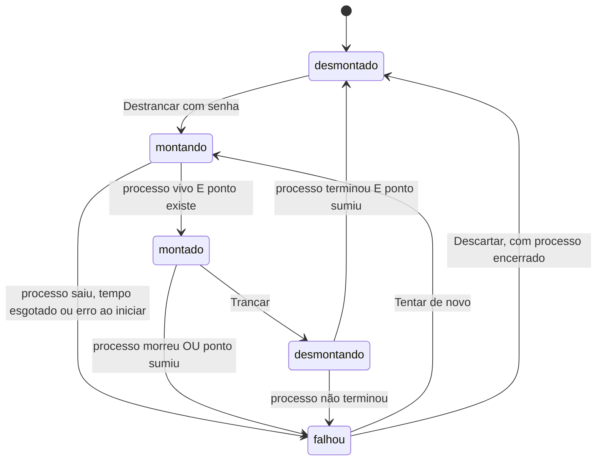
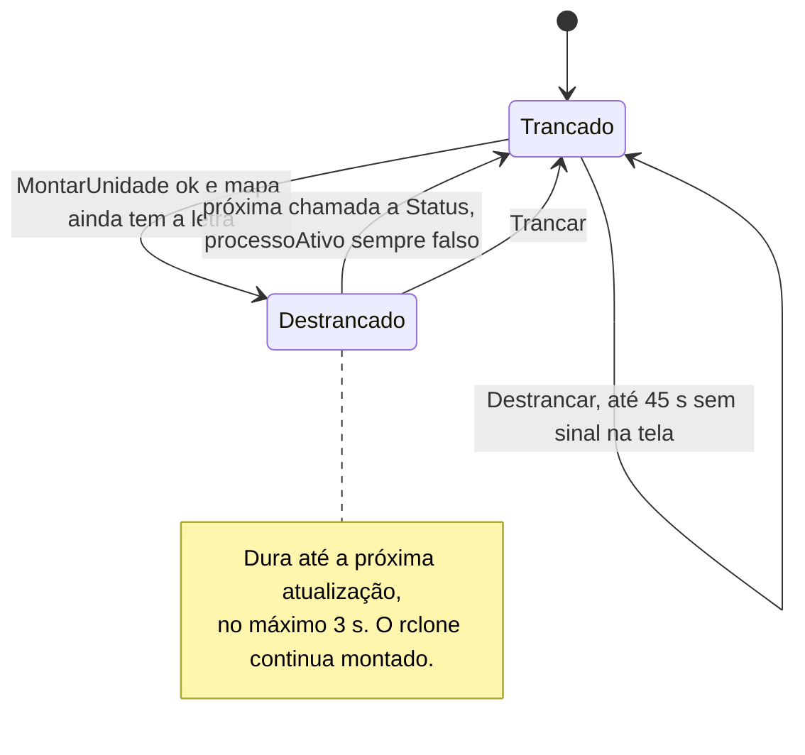
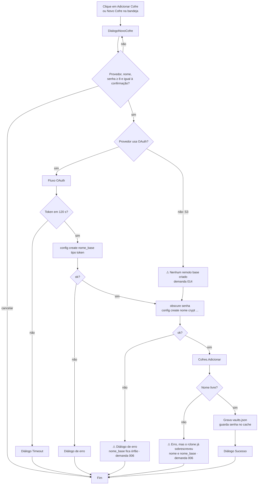
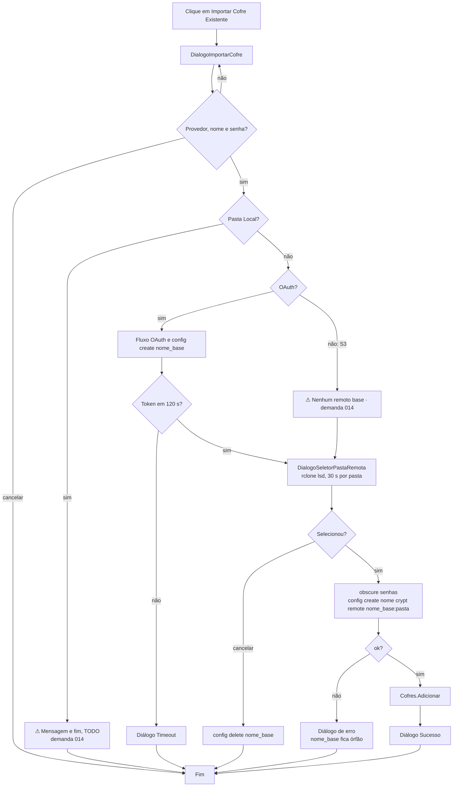
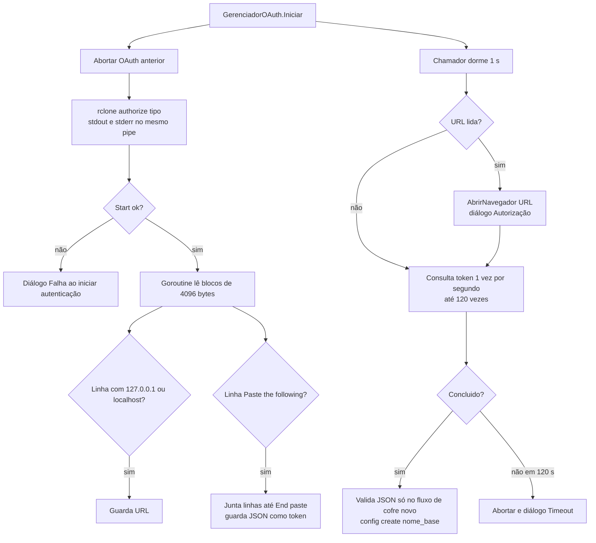
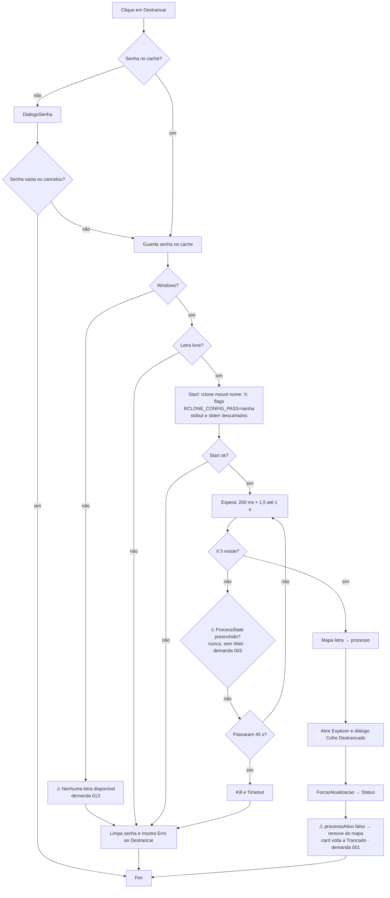
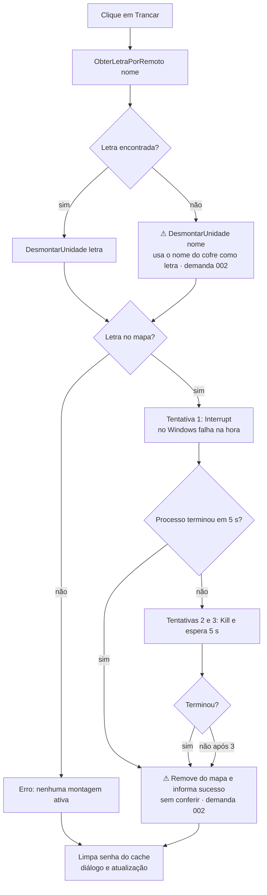
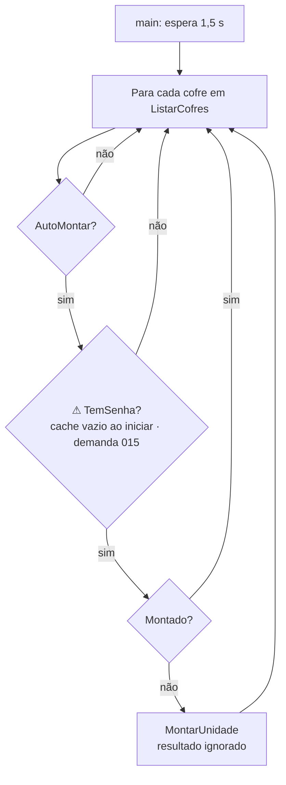
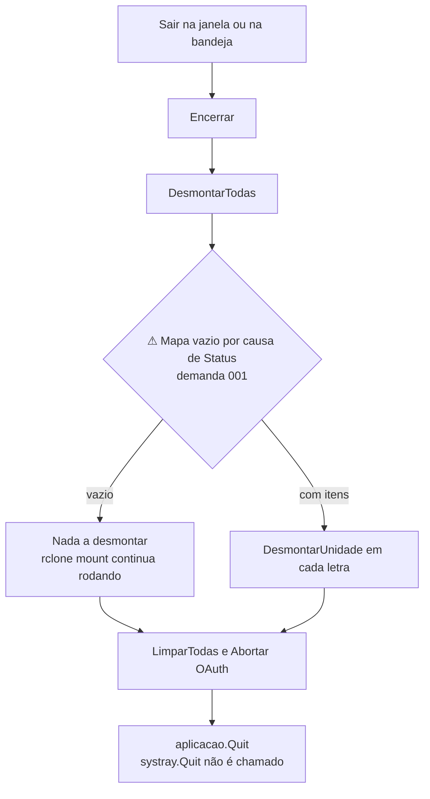

# 07 — Fluxogramas

Cada fluxo descreve o que o código faz hoje. Os pontos com defeito aparecem em nós com a marca ⚠ e apontam para a demanda.

## Estados do cofre

### Regra alvo

Quatro estados visíveis: **desmontado**, **montando**, **montado**, **falhou**.
**montado** = processo `rclone mount` vivo **E** ponto de montagem existe (letra ou pasta).

`desmontando` é um passo interno. Na tela pode aparecer como "montando" com outro texto ou ficar escondido. Isso fica para a [demanda 018](demanda/018-estados-do-cofre.md). Os quatro estados visíveis não mudam.

### Comportamento atual

| Tela | O que mostra hoje | Fonte |
|---|---|---|
| Janela de cofres | "● Trancado" em vermelho ou "● Destrancado • X:\\" em verde. Botão "Destrancar" ou "Trancar" | `gui/janela_principal.go:criarCardCofre` |
| Wizard novo cofre | Nenhum estado. Depois de "Criar Cofre", nada aparece durante o OAuth até o diálogo "Autorização" ou um erro | `gui/wizards.go:DialogoNovoCofre`, `main.go:acaoNovoCofre` |
| Wizard conectar existente | Nenhum estado. O seletor mostra "🔄 Carregando pastas..." durante o `lsd` | `gui/seletor_pasta.go` |
| Ícone da bandeja | Nenhum estado. Tooltip fixo "RuntimeCrypto — Cofre Criptografado na Nuvem" | `tray/tray.go:aoIniciar` |

| Regra | Hoje |
|---|---|
| montado exige processo vivo | Tenta conferir com `processoAtivo`, que sempre devolve falso |
| montado exige ponto de montagem | Só confere durante a espera de 45 s |
| montando visível | Não existe |
| falhou visível | Só em diálogo. Some ao fechar |

## Criar cofre

## Conectar cofre existente

## OAuth

Uma linha da saída pode ser cortada entre dois blocos de 4096 bytes. Nesse caso, a URL ou o token se perdem. O próprio `rclone authorize` também tenta abrir o navegador. Se o programa abre uma segunda aba é desconhecido.

## Destrancar (montar)

## Trancar (desmontar)

## Auto-montar ao iniciar

## Sair

