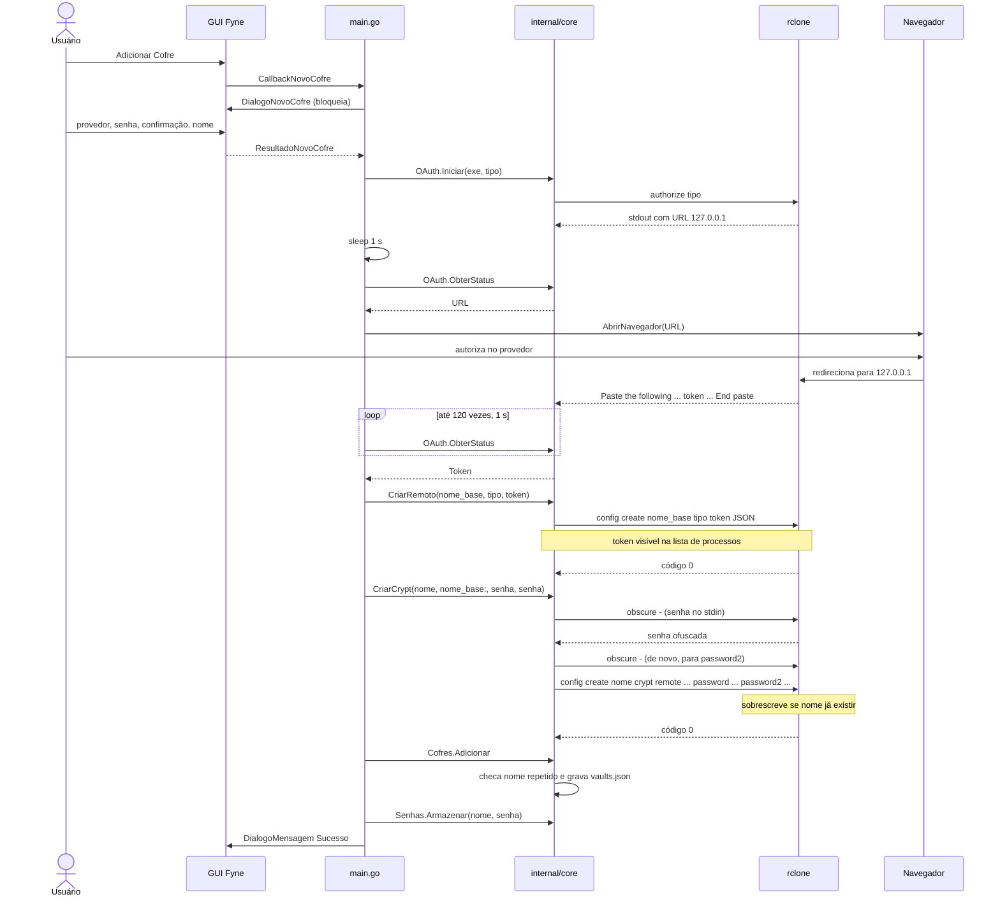
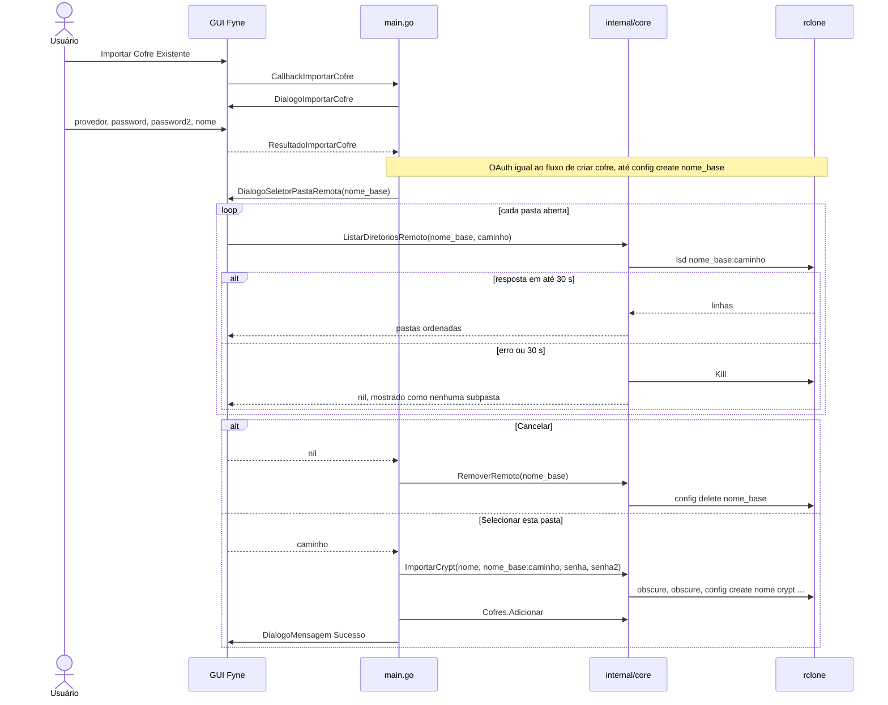
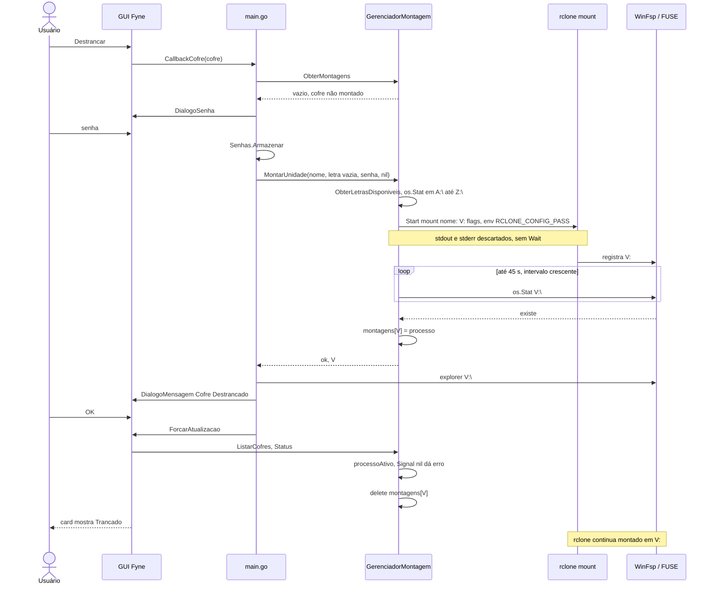
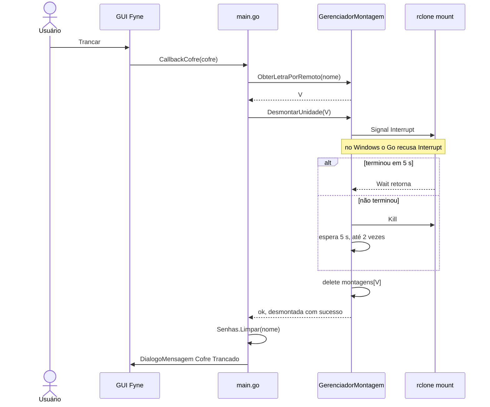
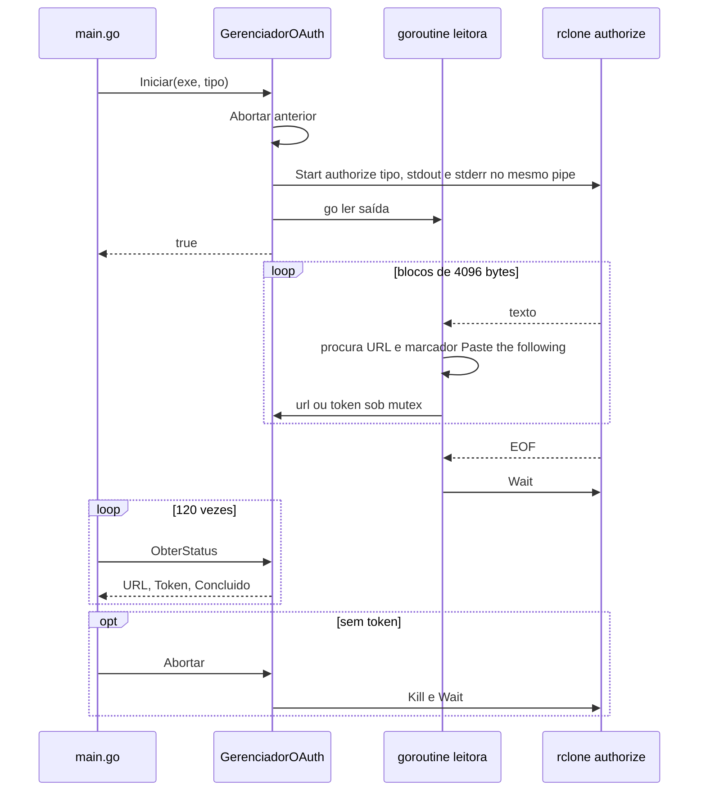
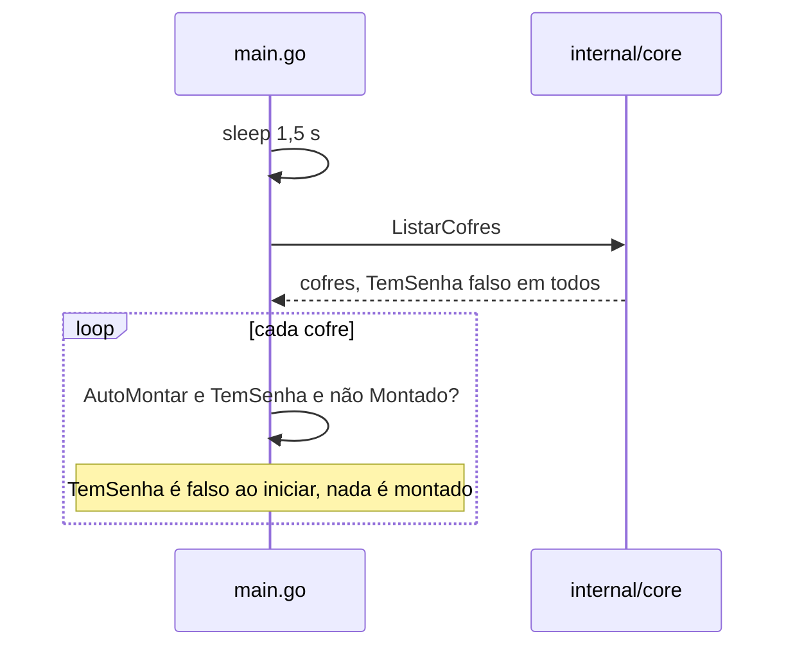

# 08 — Diagramas de sequência

Participantes: `U` usuário, `GUI` (Fyne), `Main` (`main.go`), `Core` (`internal/core`), `R` processos `rclone`, `Nav` navegador, `FS` sistema de arquivos e driver de montagem.

## Criar cofre (OAuth)

## Conectar cofre existente

## Destrancar (montar)

## Trancar (desmontar)

## OAuth

## Auto-montar

