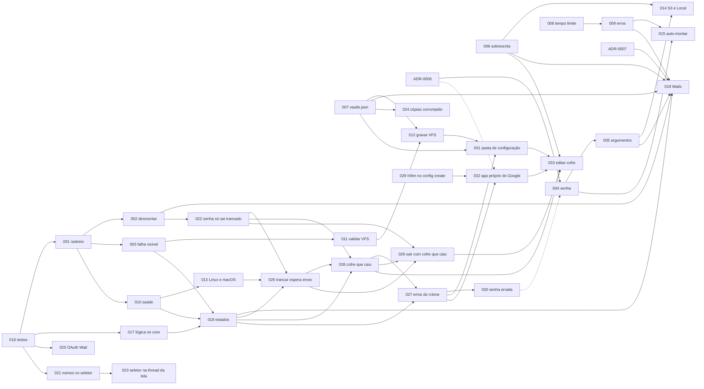

# Demandas

Regra do processo: [000-processo.md](000-processo.md). A demanda existe antes de qualquer PR de código.

A ordem segue o risco à estabilidade e aos segredos. A migração para Wails (019) vem depois das demandas de estabilidade e de segredos e depois de a lógica sair da GUI.

| Nº | Título | Risco | Depende de | Estado |
|---|---|---|---|---|
| [001](001-rastreio-de-montagem.md) | O programa perde o processo do rclone logo depois de montar | Alto · estabilidade | — | Aberta |
| [002](002-desmontagem-verificavel.md) | Trancar informa sucesso sem confirmar a desmontagem | Alto · estabilidade, segredos | 001 | Aberta |
| [003](003-falha-de-montagem-visivel.md) | Falha de montagem só aparece depois de 45 s e sem motivo | Alto · estabilidade | 001 | Aberta |
| [004](004-senha-do-cofre-nao-protege.md) | A senha de destrancar não protege o cofre | Alto · segredos | ADR-0006 | Aberta |
| [005](005-segredos-em-argumentos.md) | Token e senha ofuscada aparecem na lista de processos | Médio · segredos | 004 | Aberta |
| [006](006-criacao-sobrescreve-remoto.md) | Criar cofre pode sobrescrever um remoto existente e deixa remotos órfãos | Alto · dados | — | Aberta |
| [007](007-persistencia-vaults-json.md) | `vaults.json` corrompido é sobrescrito em silêncio | Alto · dados | — | Aberta |
| [008](008-tempo-limite-chamadas-externas.md) | Chamadas ao rclone sem tempo limite | Médio · estabilidade | — | Aberta |
| [009](009-erros-engolidos.md) | Erros engolidos viram lista vazia ou silêncio | Médio · estabilidade | 008 | Aberta |
| [010](010-saude-da-montagem.md) | Ninguém confere a montagem depois que ela sobe | Médio · estabilidade | 001 | Aberta |
| [011](011-validacao-vfs.md) | Configuração VFS aceita qualquer texto | Médio · estabilidade | 003 | Aberta |
| [012](012-persistencia-vfs.md) | Configuração VFS volta ao padrão a cada reinício | Baixo · uso | 007, 011 | Aberta |
| [013](013-montagem-linux-macos.md) | Montagem impossível em Linux e macOS | Médio · uso | 001, 010 | Aberta |
| [014](014-provedores-s3-e-local.md) | S3 e Pasta Local não funcionam nos wizards | Médio · uso | 005, 006 | Aberta |
| [015](015-auto-montar.md) | Auto-montar nunca monta | Baixo · uso | 004, 009 | Aberta |
| [016](016-testes-do-core.md) | Testes do core com executor de rclone substituível | Médio · estabilidade | — | Aberta |
| [017](017-extrair-logica-para-core.md) | Tirar a orquestração de `main.go` e as regras de `internal/gui` | Médio · estabilidade, migração | 016 | Aberta |
| [018](018-estados-do-cofre.md) | Estados do cofre visíveis: desmontado, montando, montado, falhou | Médio · uso | 001, 003, 010, 017 | Aberta |
| [019](019-migracao-wails.md) | Migrar a interface de Fyne para Wails | Alto · uso, estabilidade | 001–010, 016, 017, 018, ADR-0007 | Aberta |
| [020](020-oauth-wait-duplo.md) | OAuth chama `cmd.Wait` duas vezes no mesmo processo | Médio · estabilidade | 016 | Aberta |
| [021](021-nomes-no-seletor-de-pasta.md) | O seletor de pasta mostra "-1 alfa" no lugar de "alfa" | Médio · uso, dados | 016 | Aberta |
| [022](022-senha-so-sai-quando-trancado.md) | A senha da sessão só sai quando o cofre trancou | Médio · segredos, uso | 002 | Aberta |
| [023](023-seletor-atualiza-tela-fora-da-thread.md) | O seletor de pasta mexe na tela a partir de uma goroutine | Médio · estabilidade | 021 | Aberta |
| [024](024-copias-corrompido-acumulam.md) | Cópias `.corrompido` se acumulam | Baixo · uso | 007 | Aberta |
| [025](025-trancar-espera-envio.md) | Trancar logo depois de gravar não espera o envio | Alto · dados | 013, 018, 022 | Aberta |
| [026](026-cofre-que-caiu.md) | Cofre que caiu: destrancar de novo e trancar sem perder envio | Alto · dados, segredos | 018, 022, 025 | Aberta |
| [027](027-erros-do-rclone-em-portugues.md) | Erros do rclone em português e cabeçalho do seletor | Médio · uso | 018, 026 | Aberta |
| [028](028-sair-com-cofre-que-caiu.md) | Sair com cofre que caiu e arquivos que não subiram | Alto · dados | 022, 025, 026 | Aberta |
| [029](029-config-create-valor-com-hifen.md) | Criar cofre falha quando a senha ofuscada começa com hífen | Alto · uso | — | Aberta |
| [030](030-senha-errada-nao-destranca.md) | Senha errada não destranca | Alto · segredos | 027 | Aberta |
| [031](031-pasta-de-configuracao.md) | vaults.json e log na pasta de configuração do usuário | Alto · dados | 007, 012, 027 | Aberta |
| [032](032-app-proprio-do-google-drive.md) | App próprio do Google (client ID e client secret) no Google Drive | Médio · uso, segredos | 027, 029, ADR-0006 | Aberta |
| [033](033-editar-cofre.md) | Editar cofre: nome, app do Google, reconectar e remover (deste computador ou também do provedor) | Alto · dados, segredos | 006, 026, 028, 031, 032 | Aberta |

## Ordem sugerida de execução

A 016 não tem risco próprio, mas as outras dependem do executor falso que ela cria para ter testes. Por isso a sugestão é começar por ela, junto com a 001.

